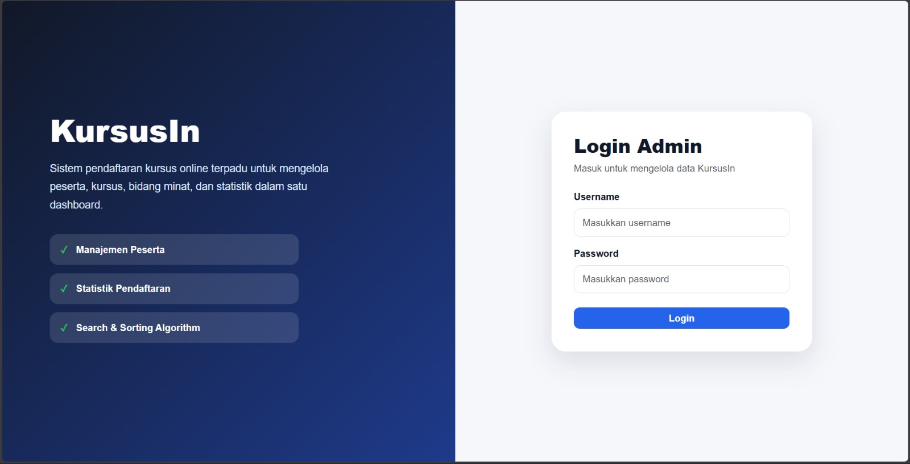
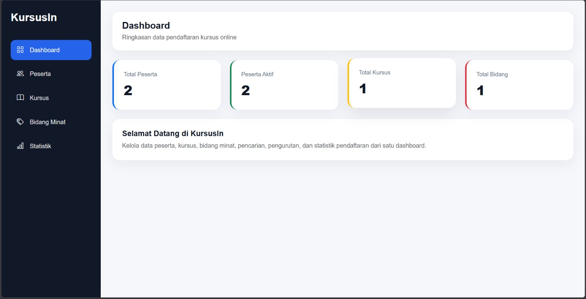
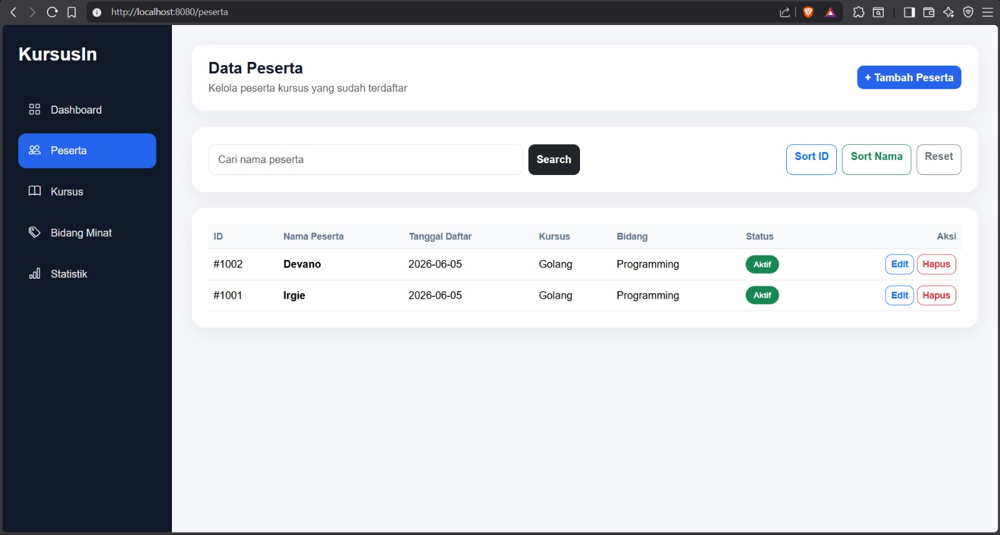
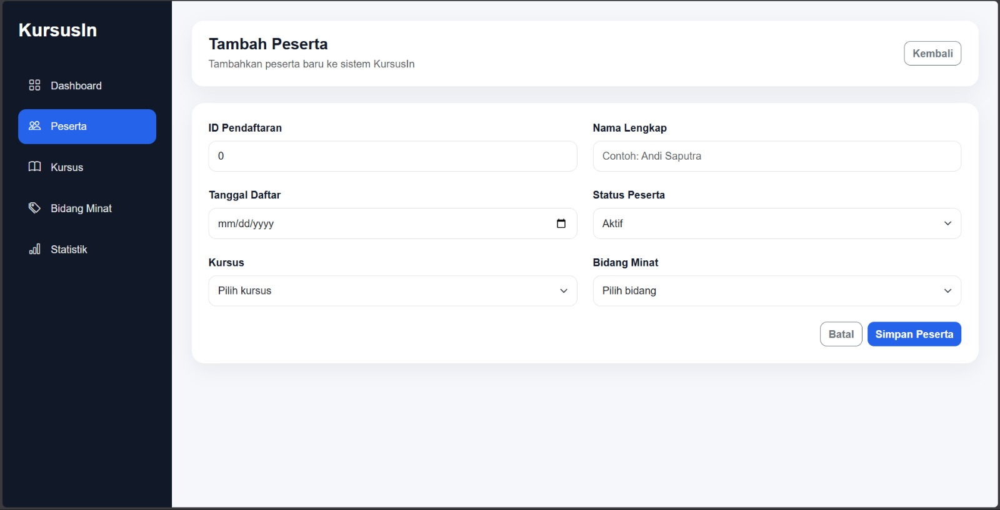
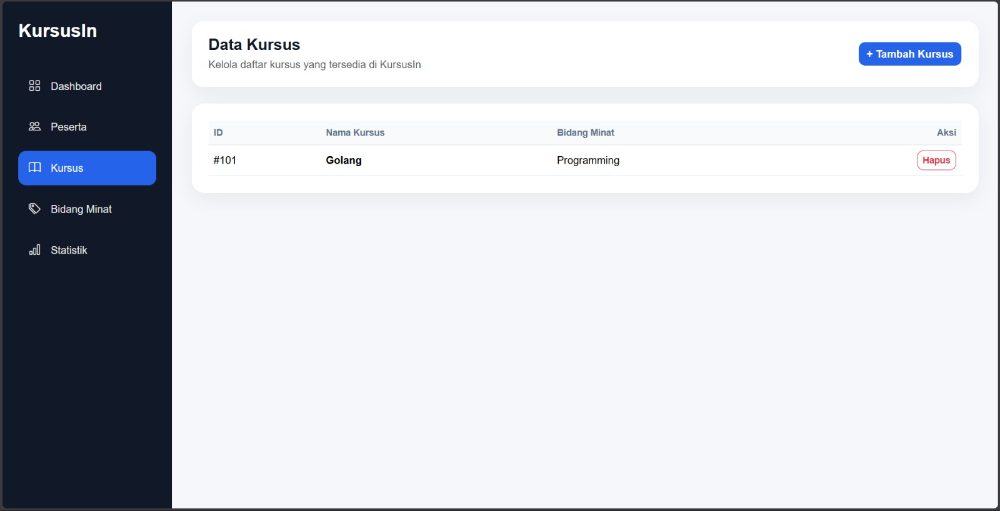
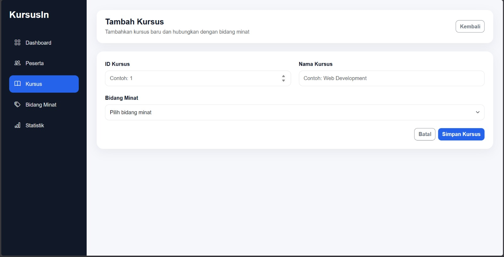
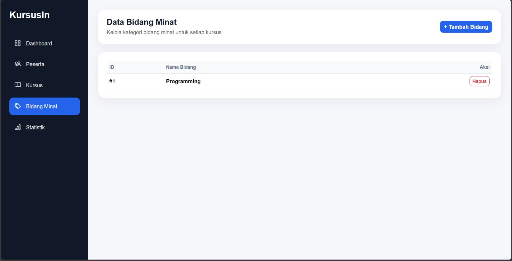
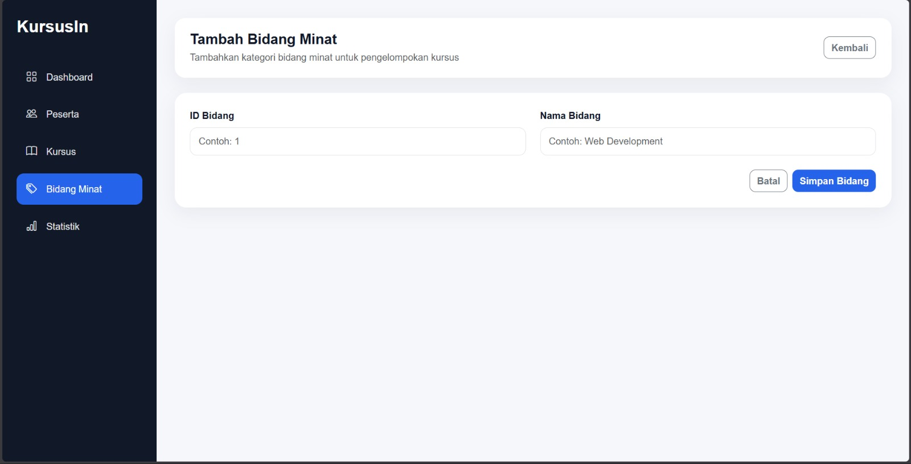
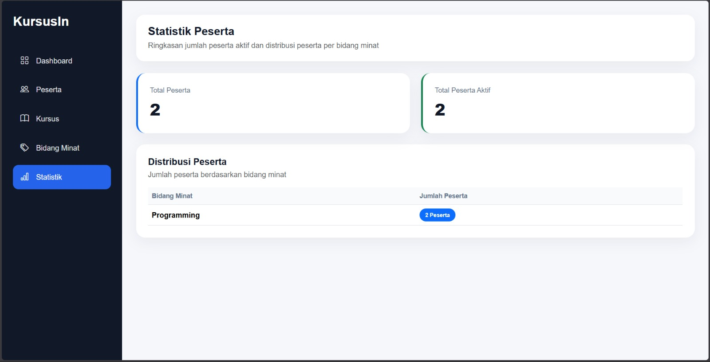

# KursusIn - Sistem Pendaftaran Kursus Online Terpadu


## Deskripsi

KursusIn adalah aplikasi web untuk manajemen pendaftaran kursus yang dibangun menggunakan Go dan Gin Framework. Sistem ini memungkinkan admin mengelola peserta, kursus, dan bidang minat, serta mengimplementasikan algoritma pencarian dan pengurutan sebagai bagian dari Tugas Besar Mata Kuliah Algoritma Pemrograman 2.

Aplikasi memungkinkan admin atau koordinator kursus untuk mengelola data peserta, data kursus, dan data bidang minat dalam satu sistem terintegrasi.

---

## Live Demo

🌐 kursusin-web.up.railway.app

## Features

- Login Authentication
- Session-based Access Control
- Protected Routes
- CRUD Peserta
- CRUD Kursus
- CRUD Bidang Minat
- Sequential Search
- Binary Search
- Selection Sort
- Insertion Sort
- Dashboard UI
- Statistik Peserta
- PostgreSQL Database
- Railway Cloud Deployment
- Live Deployment

## Tampilan Aplikasi

### Login Page



### Dashboard



### Data Peserta



### Form Peserta



### Data Kursus



### Form Kursus



### Data Bidang Minat



### Form Bidang Minat



### Statistik Peserta



## Progress

- [x] Authentication
- [x] Route Protection
- [x] Login UI
- [x] CRUD Peserta
- [x] CRUD Kursus
- [x] CRUD Bidang Minat
- [x] Sequential Search
- [x] Binary Search
- [x] Selection Sort
- [x] Insertion Sort
- [x] Statistik Peserta
- [x] PostgreSQL Integration
- [x] Railway Deployment

## Fitur Utama

### Manajemen Peserta

- Tambah data peserta
- Lihat daftar peserta
- Edit data peserta
- Hapus data peserta
- Pencatatan tanggal pendaftaran
- Status peserta aktif/tidak aktif

### Manajemen Kursus

- Tambah kursus
- Lihat daftar kursus
- Pengelolaan relasi kursus dengan bidang minat

### Manajemen Bidang Minat

- Tambah bidang minat
- Lihat daftar bidang minat

### Algoritma yang Diimplementasikan

- Sequential Search
- Binary Search
- Selection Sort
- Insertion Sort

### Statistik

- Total peserta
- Total peserta aktif
- Jumlah peserta berdasarkan bidang minat

---

## Authentication

Aplikasi dilengkapi sistem login berbasis session untuk membatasi akses ke halaman dashboard dan manajemen data.

Default Login:

Username: admin
Password: admin123

## Database

KursusIn menggunakan PostgreSQL sebagai database utama yang di-host pada Railway.

Tabel utama:

- peserta
- kursus
- bidang

Seluruh operasi CRUD, statistik, pencarian, dan pengurutan menggunakan data yang tersimpan di PostgreSQL.

## Teknologi

- Go (Golang)
- Gin Framework
- PostgreSQL
- Railway
- HTML Template
- Bootstrap 5
- Bootstrap Icons
- Custom CSS Dashboard
- Session Cookie Authentication

---

## Struktur Project

## Struktur Project

```text
kursusin-web/
├── assets/
│   ├── login-page.jpeg
│   ├── dashboard-page.jpeg
│   ├── peserta-page.jpeg
│   ├── peserta-form.jpeg
│   ├── kursus-page.jpeg
│   ├── kursus-form.jpeg
│   ├── bidang-page.jpeg
│   ├── bidang-form.jpeg
│   └── statistik-page.jpeg
│
├── static/
│   └── css/
│       └── style.css
│
├── templates/
│   ├── login.html
│   ├── index.html
│   ├── peserta.html
│   ├── kursus.html
│   ├── bidang.html
│   ├── statistik.html
│   ├── form_peserta.html
│   ├── form_kursus.html
│   ├── form_bidang.html
│   └── layout_head.html
│
├── database.go
├── main.go
├── go.mod
├── go.sum
└── README.md
```

## Struktur Project

| Folder/File | Fungsi |
|------------|---------|
| assets | Screenshot dokumentasi aplikasi |
| database.go | Koneksi dan operasi PostgreSQL |
| static | CSS dan aset statis |
| templates | Tampilan HTML |
| main.go | Routing, handler, algoritma, dan autentikasi |
| README.md | Dokumentasi project |

## Cara Menjalankan

### Clone Repository

```bash
git clone https://github.com/dpndri/kursusin-web.git
cd kursusin-web
```

### Install Dependency

```bash
go mod tidy
```

### Jalankan Aplikasi

```bash
go run main.go
```

### Buka Browser

```text
http://localhost:8080
```

---

## Alur Penggunaan

1. Tambahkan bidang minat.
2. Tambahkan kursus.
3. Tambahkan peserta.
4. Gunakan fitur pencarian dan pengurutan.
5. Lihat statistik peserta pada halaman statistik.

---

## Implementasi Algoritma

### Sequential Search

Digunakan untuk mencari peserta berdasarkan nama atau bidang minat pada data yang belum terurut.

### Binary Search

Digunakan untuk pencarian data peserta pada data yang telah diurutkan.

### Selection Sort

Digunakan untuk mengurutkan peserta berdasarkan ID pendaftaran.

### Insertion Sort

Digunakan untuk mengurutkan peserta berdasarkan nama peserta secara alfabetis.

---

## Pengembang

| Keterangan  | Detail                                                          |
| ----------- | --------------------------------------------------------------- |
| Nama        | Muhammad Irgie Dapiandri                                        |
| Mata Kuliah | Algoritma Pemrograman 2                                         |
| Proyek      | Tugas Besar Sistem Pendaftaran Kursus Online Terpadu (KursusIn) |

---

## Future Improvements

- Role-based Access Control
- Password Hashing (bcrypt)
- Docker Containerization
- Export Data (CSV/PDF)
- Responsive Mobile Layout

## Lisensi

Project ini dibuat untuk kebutuhan pembelajaran dan akademik.
