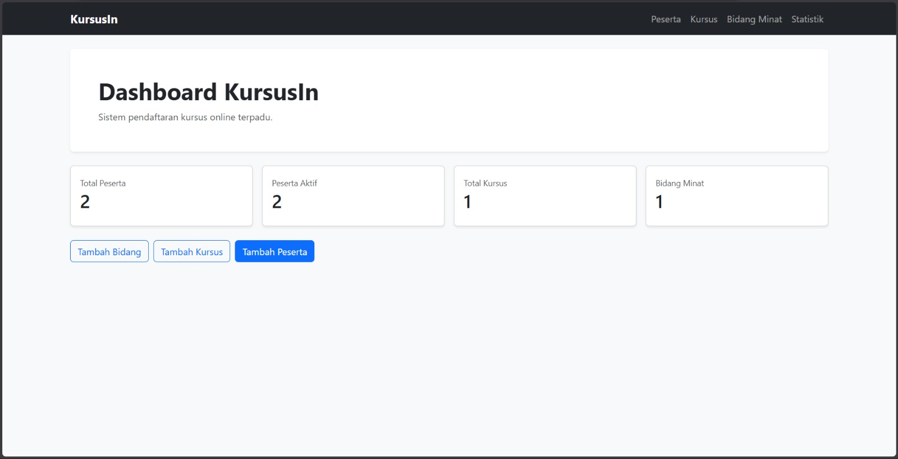
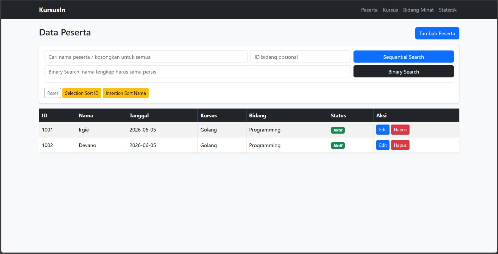
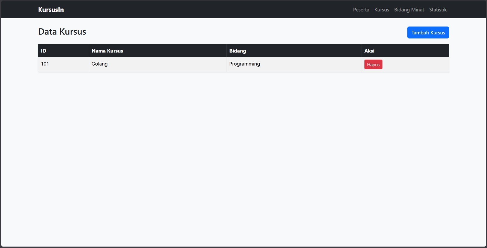
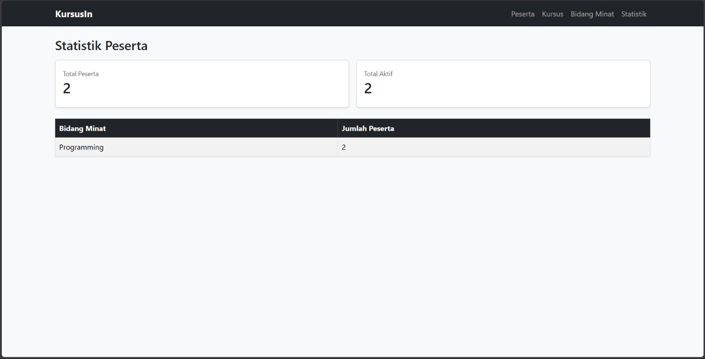

# KursusIn - Sistem Pendaftaran Kursus Online Terpadu


## Deskripsi

KursusIn adalah aplikasi web berbasis Go yang digunakan untuk mengelola pendaftaran peserta pada berbagai program pelatihan digital. Sistem ini dikembangkan sebagai Tugas Besar Mata Kuliah Algoritma Pemrograman 2.

Aplikasi memungkinkan admin atau koordinator kursus untuk mengelola data peserta, data kursus, dan data bidang minat dalam satu sistem terintegrasi.

---

## Tampilan Aplikasi

### Dashboard



### Data Peserta



### Data Kursus



### Statistik



## Progress

- [x] CRUD Peserta
- [x] CRUD Kursus
- [x] CRUD Bidang Minat
- [x] Sequential Search
- [x] Binary Search
- [x] Selection Sort
- [x] Insertion Sort
- [x] Statistik Peserta
- [x] Penyimpanan JSON
- [ ] Deployment

## Fitur Utama

### Manajemen Peserta

* Tambah data peserta
* Lihat daftar peserta
* Edit data peserta
* Hapus data peserta
* Pencatatan tanggal pendaftaran
* Status peserta aktif/tidak aktif

### Manajemen Kursus

* Tambah kursus
* Lihat daftar kursus
* Pengelolaan relasi kursus dengan bidang minat

### Manajemen Bidang Minat

* Tambah bidang minat
* Lihat daftar bidang minat

### Algoritma yang Diimplementasikan

* Sequential Search
* Binary Search
* Selection Sort
* Insertion Sort

### Statistik

* Total peserta
* Total peserta aktif
* Jumlah peserta berdasarkan bidang minat

---

## Teknologi

* Go (Golang)
* Gin Framework
* HTML Template
* Bootstrap 5
* JSON Storage

---

## Struktur Project

```text
kursusin-web/
│
├── data/
│   └── kursusin.json
│
├── templates/
│   ├── index.html
│   ├── peserta.html
│   ├── kursus.html
│   ├── bidang.html
│   ├── statistik.html
│   ├── form_peserta.html
│   ├── form_kursus.html
│   ├── form_bidang.html
│   └── layout_head.html
│
├── main.go
├── go.mod
├── go.sum
└── README.md
```

---

## Cara Menjalankan

### Clone Repository

```bash
git clone https://github.com/dpndri/kursusin-web.git
cd kursusin-web
```

### Install Dependency

```bash
go mod tidy
```

### Jalankan Aplikasi

```bash
go run main.go
```

### Buka Browser

```text
http://localhost:8080
```

---

## Alur Penggunaan

1. Tambahkan bidang minat.
2. Tambahkan kursus.
3. Tambahkan peserta.
4. Gunakan fitur pencarian dan pengurutan.
5. Lihat statistik peserta pada halaman statistik.

---

## Implementasi Algoritma

### Sequential Search

Digunakan untuk mencari peserta berdasarkan nama atau bidang minat pada data yang belum terurut.

### Binary Search

Digunakan untuk pencarian data peserta pada data yang telah diurutkan.

### Selection Sort

Digunakan untuk mengurutkan peserta berdasarkan ID pendaftaran.

### Insertion Sort

Digunakan untuk mengurutkan peserta berdasarkan nama peserta secara alfabetis.

---

## Pengembang

Nama: Muhammad Irgie Dapiandri 
Mata Kuliah: Algoritma Pemrograman 2
Proyek: Tugas Besar Sistem Pendaftaran Kursus Online Terpadu (KursusIn)

---

## Lisensi

Project ini dibuat untuk kebutuhan pembelajaran dan akademik.
